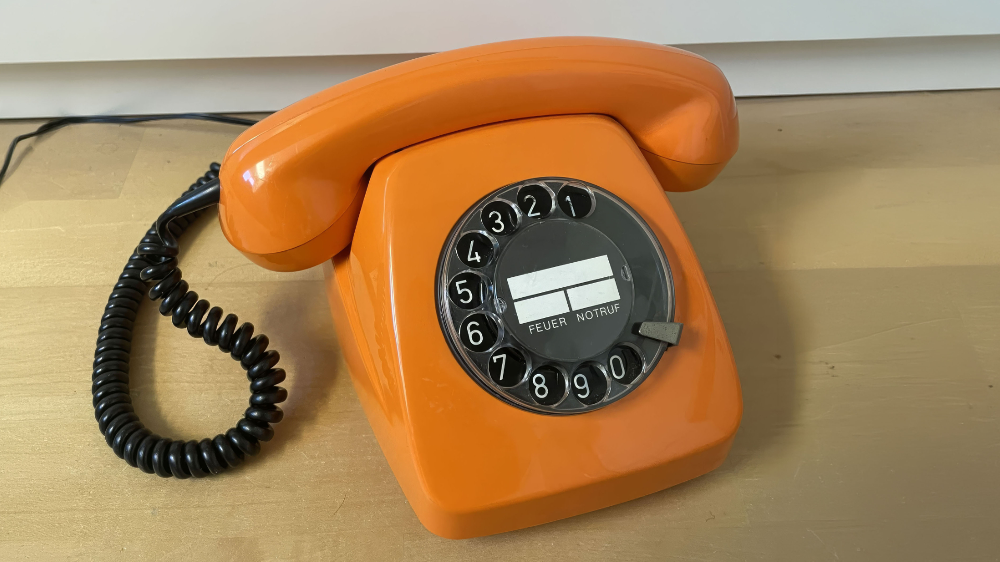

Maker Media GmbH

***

# KI-Telefon

**In diesem Projekt habe ich einem alten „Telekom 611-2“-Tischtelefon neues Leben eingehaucht. Abheben, wählen, sprechen – genau wie früher, nur dass am anderen Ende kein Mensch, sondern eine KI den Hörer abnimmt. Ein Raspberry Pi und die API-Schnittstelle von OpenAI machen Echtzeitgespräche möglich.**

Die Benötigten Dateien für das Projekt liegen in diesem GitHub-Repository.

Der vollständige Artikel zum Projekt steht in der **[Make-Ausgabe 2/26](https://www.heise.de/select/make/2026/2)**.
